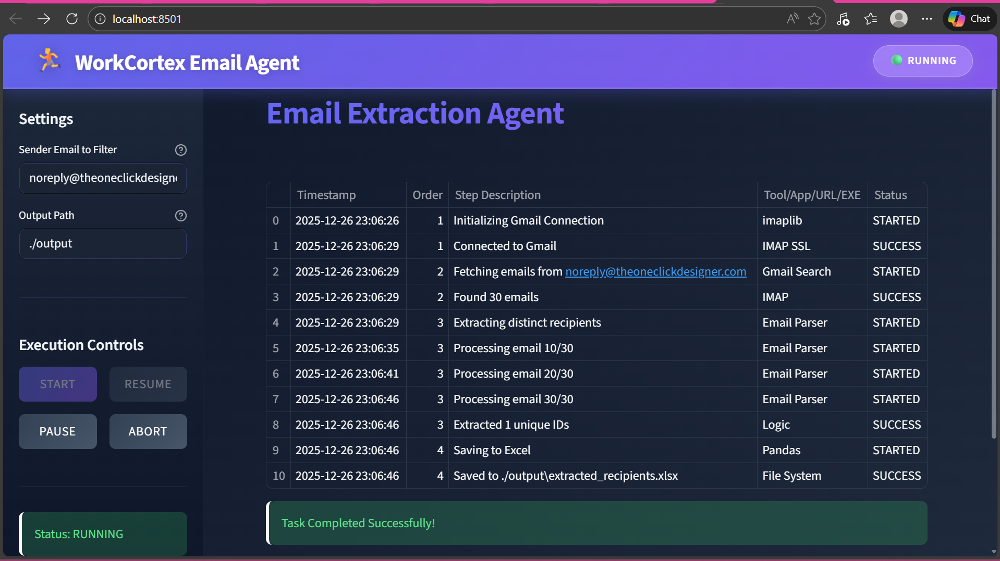
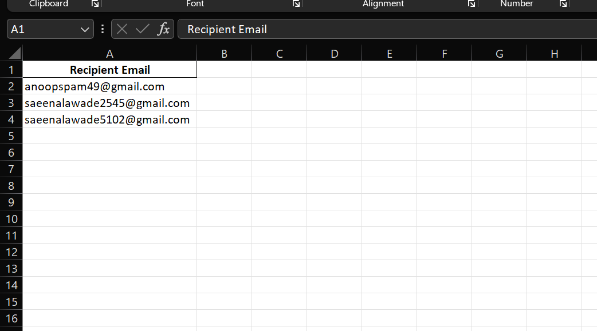

# 📧 WorkCortex Email Extraction System

A Python-based email extraction system that fetches emails from Gmail, extracts distinct recipient addresses, and saves them to Excel with live execution logging.

## 🎯 Features

- Gmail IMAP integration with secure authentication
- Filter emails by sender address
- Extract and deduplicate recipient email addresses
- Export to Excel at configurable location
- Live execution logs with UI controls (Start/Pause/Resume/Abort)
- Automatic retry mechanism for failed connections
- Real-time status updates: STARTED, SUCCESS, FAILED, RETRIED

## 📁 Project Structure

Workcortex/
├── engine/
│   ├── email_client.py      # Gmail IMAP client
│   ├── logger.py            # Live logging system
│   └── processor.py         # Data processing & Excel export
├── output/                  # Excel output directory
├── .env.example             # Credentials template
├── main.py                  # CLI interface
├── ui.py                    # Streamlit UI
└── requirements.txt         # Dependencies

## 🚀 Quick Start

### 1. Installation

```bash
# Clone repository
git clone <your-repo-url>
cd Workcortex

# Create virtual environment
python -m venv venv
venv\Scripts\activate          # Windows
# source venv/bin/activate     # macOS/Linux

# Install dependencies
pip install -r requirements.txt
```

### 2. Configuration

Create `.env` file in project root:

```env
GMAIL_USER=your-email@gmail.com
GMAIL_PASS=your-app-password
```

> **Note**: Use Gmail App Password (requires 2FA). [Create App Password](https://support.google.com/accounts/answer/185833)

### 3. Run Application

**UI Mode (Recommended):**
```bash
streamlit run ui.py
```

**CLI Mode:**
```bash
python main.py
```

## 🎥 Demo

<video controls src="20251226-1800-19.0503780.mp4" title="demo"></video>

## 🎮 UI Controls

- **▶️ START** - Begin email extraction
- **⏸️ PAUSE** - Pause execution
- **▶️ RESUME** - Resume paused execution
- **⏹️ ABORT** - Stop execution immediately

## 📊 Live Execution Logs


## 📝 Sample Output

Excel file with deduplicated, sorted recipient emails:


## 🏗️ Architecture & Design Decisions

### Technology Stack
- **IMAP (imaplib)**: Direct Gmail access, no API quotas
- **Streamlit**: Rapid UI development with built-in state management
- **Pandas + openpyxl**: Industry-standard data manipulation and Excel export
- **python-dotenv**: Secure credential management

### Modular Design
- `email_client.py`: Gmail IMAP operations (connect, fetch, extract)
- `logger.py`: Live logging with required columns
- `processor.py`: Email deduplication and Excel export
- `ui.py`: Streamlit UI with execution controls
- `main.py`: CLI interface

### Key Features
- **Retry Mechanism**: Auto-retry (3 attempts) for connection failures
- **Pause/Resume**: Session state-based execution control
- **Live Logging**: Real-time table updates via Streamlit placeholders
- **Security**: Environment variables, no hard-coded credentials

## � Dependencies

streamlit       # Web UI framework
pandas          # Data manipulation
openpyxl        # Excel file support
python-dotenv   # Environment variables


---

**Built for WorkCortex Intelligence Pvt Ltd**
